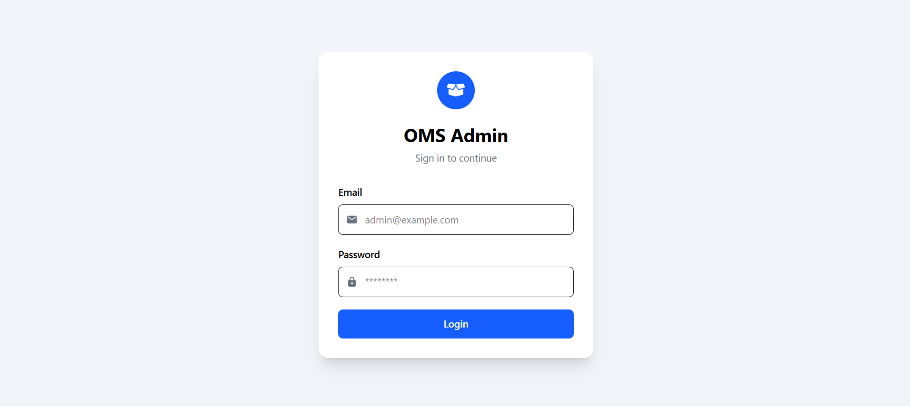
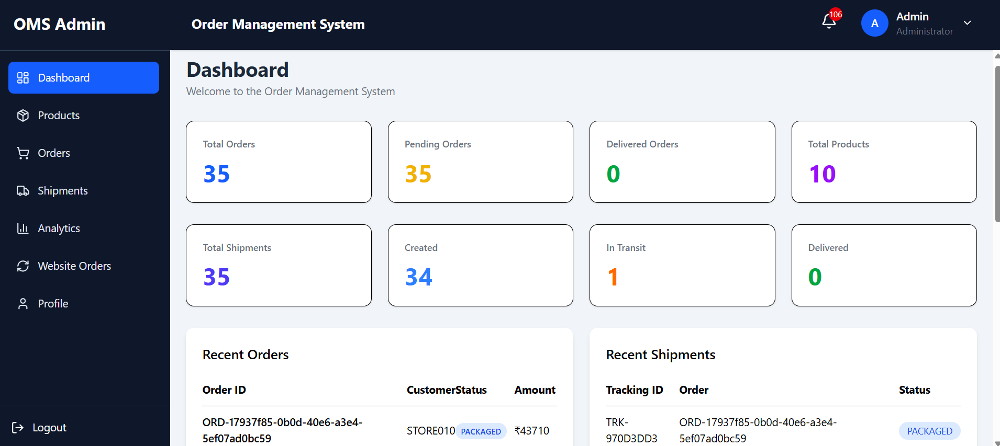
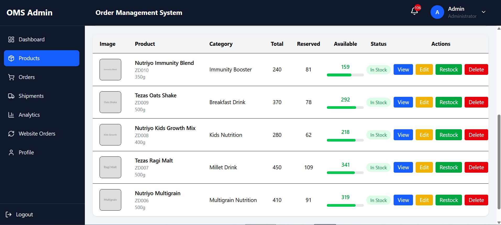
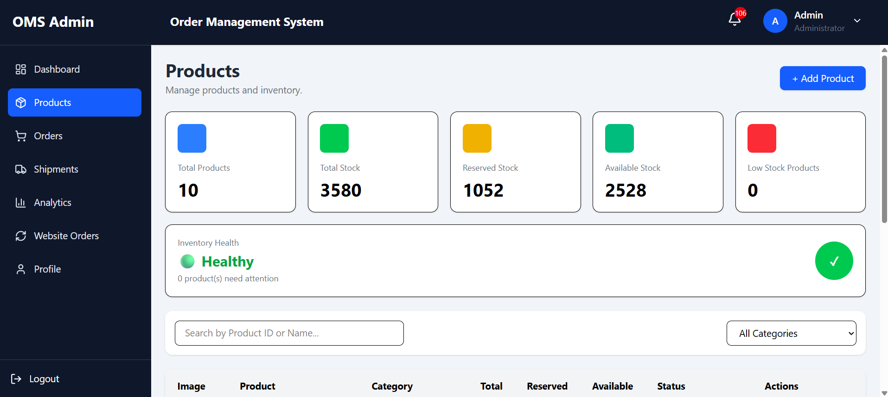
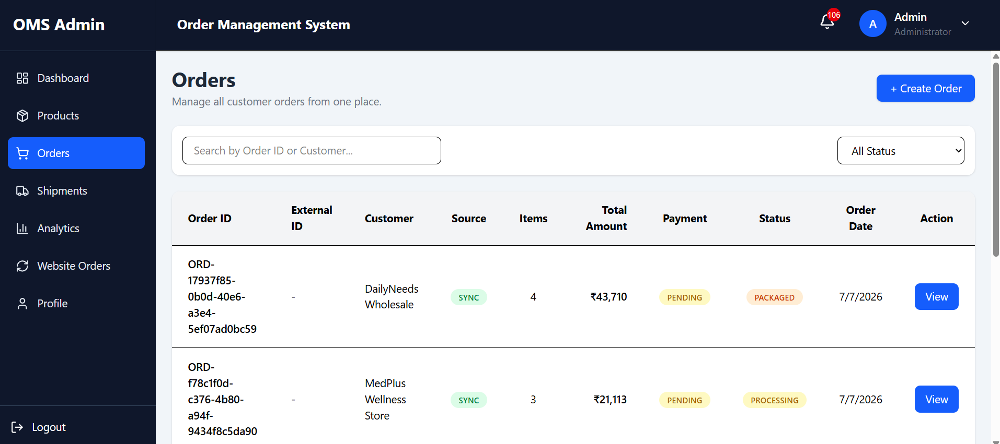
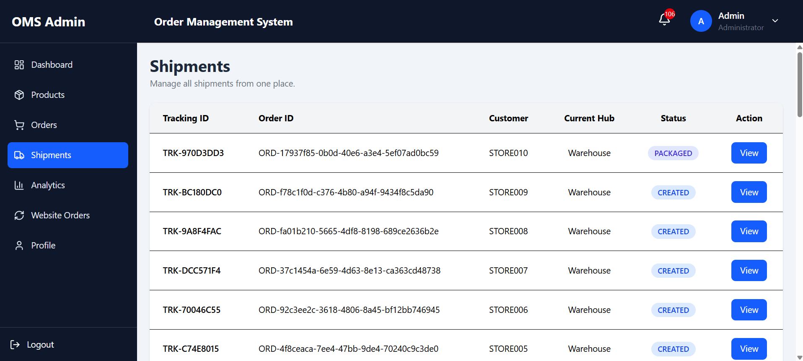
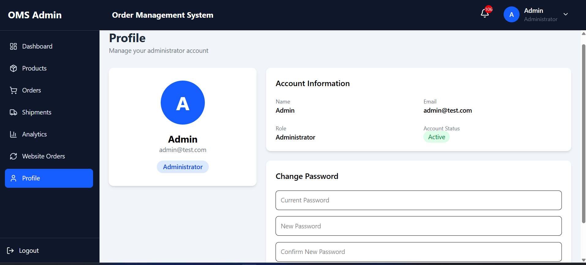
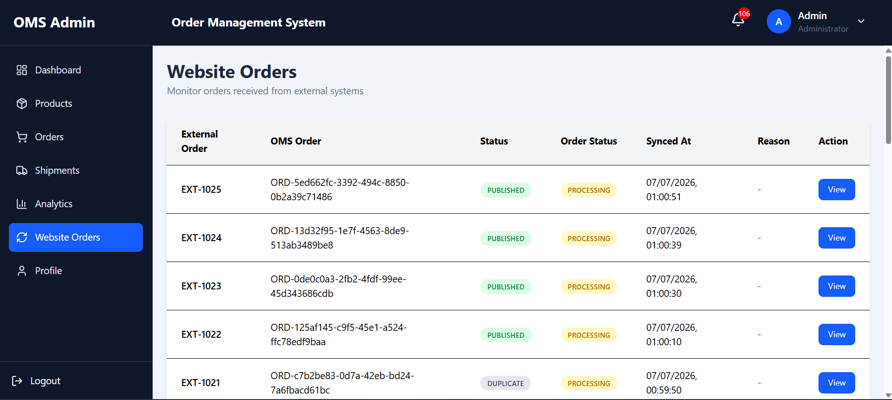

# 📦 Order Management System


A scalable and event-driven **Order Management System (OMS)** built using **Node.js**, **Express.js**, **React.js**, **MongoDB**, **Apache Kafka**, and **Docker** following a **Microservices Architecture**.

The project is designed as a collection of independent services, each responsible for a specific business capability such as authentication, order processing, inventory management, shipment handling, notifications, and external system synchronization. All client requests are routed through a centralized **API Gateway**, while inter-service communication is handled asynchronously using **Apache Kafka**.

The entire application is containerized using **Docker Compose**, enabling easy deployment and ensuring a consistent development environment across different machines.

---

## 📑 Table of Contents

- [🚀 Features](#-key-features)
- [🏗️ System Architecture](#️-system-architecture)
- [🧩 Microservices](#-microservices)
- [📨 Apache Kafka](#-apache-kafka)
- [🐳 Docker](#-docker)
- [💻 Technologies Used](#-technologies-used)
- [📸 Application Screenshots](#-application-screenshots)
- [📂 Project Structure](#-project-structure)
- [📁 Infrastructure](#-infrastructure)
- [⚙️ Prerequisites](#️-prerequisites)
- [📥 Clone the Repository](#-clone-the-repository)
- [📦 Install Dependencies](#-install-dependencies)
- [🔐 Environment Variables](#-environment-variables)
- [▶️ Running the Project](#️-running-the-project)
- [🐳 Useful Docker Commands](#-useful-docker-commands)
- [📨 Kafka Topic Creation](#-kafka-topic-creation)
- [🌐 API Gateway](#-api-gateway)
- [📡 API Documentation](#-api-documentation)
- [🔄 Event-Driven Workflow](#-event-driven-workflow)
- [🔒 Authentication](#-authentication)
- [🚀 Future Scope](#-future-scope)
- [👥 Contributors](#-contributors)

# 🚀 Key Features

- Microservices-based architecture
- Centralized API Gateway
- JWT-based Authentication & Authorization
- Event-driven communication using Apache Kafka
- Order lifecycle management
- Automated inventory reservation
- Shipment lifecycle management
- Notification management
- External system synchronization
- MongoDB for persistent data storage
- Dockerized deployment
- Environment-based configuration
- RESTful APIs

---

# 🏗️ System Architecture

The application follows a **Microservices Architecture**, where each service is independently deployable and responsible for a single business capability.

Instead of communicating directly with each other, services exchange events through **Apache Kafka**, resulting in loose coupling, better scalability, and improved fault tolerance.

The **React Frontend** communicates only with the **API Gateway**, which routes requests to the appropriate microservice.

```
                              User
                                │
                                ▼
                       React Frontend
                                │
                                ▼
                          API Gateway
                                │
      ┌─────────────┬────────────┬────────────┬────────────┬─────────────┬────────────┐
      ▼             ▼            ▼            ▼            ▼             ▼
 Auth Service   Order Service Inventory Service Shipment Service Notification Service Sync Service
                      │              │                │                     │
                      └──────────────┴────────────────┴─────────────────────┘
                                      │
                                      ▼
                                Apache Kafka
```

---

# 🧩 Microservices

## Frontend

The frontend is developed using **React.js** and provides an intuitive user interface for interacting with the Order Management System. It communicates exclusively with the **API Gateway**, ensuring that the internal microservice architecture remains hidden from the client.

---

## API Gateway

The API Gateway acts as the single entry point for all client requests. It forwards incoming HTTP requests to the appropriate microservice using Axios, centralizes routing, and abstracts the internal service architecture from the frontend.

---

## Authentication Service

The Authentication Service manages user registration, login, and authentication using **JSON Web Tokens (JWT)**. It validates user credentials and secures protected APIs by issuing and verifying authentication tokens.

---

## Order Service

The Order Service is responsible for creating, updating, retrieving, and cancelling customer orders. It also publishes order-related events to Kafka, enabling other services to react asynchronously.

---

## Inventory Service

The Inventory Service manages product stock levels and reserves inventory whenever a new order is placed. It publishes inventory status events that trigger subsequent workflows such as shipment creation.

---

## Shipment Service

The Shipment Service automatically creates shipments after successful inventory reservation. It manages the shipment lifecycle by publishing status updates such as packaging, pickup, transit, delivery, and cancellation through Kafka.

---

## Notification Service

The Notification Service consumes Kafka events and stores notifications in the database, allowing users to view order and shipment updates directly within the OMS application.

---

## Sync Service

The Sync Service synchronizes order data with external systems through dedicated APIs.
---

# 📨 Apache Kafka

Apache Kafka serves as the messaging backbone of the application, enabling asynchronous communication between microservices.

Instead of relying on direct service-to-service API calls, producers publish events to Kafka topics while interested services consume them independently. This event-driven approach improves scalability, reduces coupling, and enhances system reliability.

## Kafka Topics

### Order Events

| Topic | Producer | Consumers | Purpose |
|--------|----------|-----------|---------|
| `order.created` | Order Service | Inventory, Notification, Sync | Trigger inventory reservation, notifications, and synchronization. |
| `order.updated` | Order Service | Notification, Sync | Notify order updates across services. |
| `order.cancelled` | Order Service | Inventory, Notification, Sync | Release inventory and synchronize cancellations. |

### Inventory Events

| Topic | Producer | Consumers | Purpose |
|--------|----------|-----------|---------|
| `inventory.reserved` | Inventory Service | Shipment Service | Trigger shipment creation after successful reservation. |
| `inventory.failed` | Inventory Service | Order Service | Mark order as failed due to insufficient stock. |
| `inventory.released` | Inventory Service | Order Service | Release reserved inventory after cancellation. |
| `inventory.low_stock_warning` | Inventory Service | Notification Service | Notify about low inventory levels. |

### Shipment Events

| Topic | Producer | Consumers | Purpose |
|--------|----------|-----------|---------|
| `shipment.created` | Shipment Service | Notification, Sync | Shipment created. |
| `shipment.packaged` | Shipment Service | Notification, Sync | Shipment packaged. |
| `shipment.picked_up` | Shipment Service | Notification, Sync | Shipment picked up by courier. |
| `shipment.at_origin_hub` | Shipment Service | Notification, Sync | Shipment reached origin hub. |
| `shipment.in_transit` | Shipment Service | Notification, Sync | Shipment is in transit. |
| `shipment.at_destination_hub` | Shipment Service | Notification, Sync | Shipment reached destination hub. |
| `shipment.out_for_delivery` | Shipment Service | Notification, Sync | Shipment is out for delivery. |
| `shipment.delivered` | Shipment Service | Notification, Sync | Shipment delivered successfully. |
| `shipment.cancelled` | Shipment Service | Notification, Sync | Shipment cancelled. |

### Synchronization Events

| Topic | Producer | Consumer | Purpose |
|--------|----------|----------|---------|
| `sync.order.created` | Sync Service | External API | Synchronize newly created orders. |
| `sync.order.updated` | Sync Service | External API | Synchronize order updates. |
| `sync.order.cancelled` | Sync Service | External API | Synchronize cancelled orders. |

---

# 🐳 Docker

The complete application is containerized using **Docker**, with each microservice running in its own isolated container.

Docker Compose orchestrates the frontend, API Gateway, all microservices, Kafka, MongoDB, and supporting infrastructure, enabling the entire application to be started using a single command.

---

# 💻 Technologies Used

## Frontend

- React.js
- Axios
- JavaScript
- HTML5
- CSS3

## Backend

- Node.js
- Express.js

## Database

- MongoDB
- Mongoose

## Authentication

- JSON Web Token (JWT)

## Messaging

- Apache Kafka

## DevOps

- Docker
- Docker Compose

## API Communication

- REST APIs
- Axios

## Utilities

- dotenv
- bcrypt

---

# 📸 Application Screenshots

## 🔐 Login

The login page allows users to securely authenticate using their credentials.



---

## 📊 Dashboard

The dashboard provides an overview of the system, displaying key information and quick navigation to different modules.



---

## 📦 Products

The products page displays all available products and allows users to browse product information.



---

## 📦 Inventory Management

The inventory page enables administrators to monitor stock levels, reserve inventory, restock products, and manage inventory records.



---

## 🛒 Orders

The orders page allows users to create, view, and manage customer orders while tracking their current status.



---

## 🚚 Shipment Tracking

The shipment module displays shipment details and tracking information throughout the delivery lifecycle.



---

## 👤 User Profile

The profile page allows users to view and manage their account information.



---

## 🌐 Website Orders

The Website Orders page displays orders synchronized with the external system through the Sync Service.




# 📂 Project Structure

```text
Order-Management-System/
│
├── frontend/                    # React application
│
├── gateway/                     # API Gateway (Single entry point)
│
├── infrastructure/              # Kafka configuration and infrastructure setup
│
├── services/
│   ├── analytics-service/       # Planned analytics service
│   ├── auth-service/            # User authentication and authorization
│   ├── inventory-service/       # Inventory reservation and stock management
│   ├── notification-service/    # Stores user notifications
│   ├── order-service/           # Order management
│   ├── shipment-service/        # Shipment lifecycle management
│   └── sync-service/            # Synchronization with external systems
│
├── docker-compose.yml
├── package.json
├── package-lock.json
├── .gitignore
└── README.md
```

---

# 📁 Infrastructure

The **infrastructure** directory contains the configurations required to run the distributed system.

It includes:

- Apache Kafka configuration
- Kafka topic creation scripts
- Docker configuration files
- Supporting infrastructure required by the microservices

This separation keeps infrastructure concerns independent from business logic.

---

# ⚙️ Prerequisites

Before running the project, ensure the following are installed:

- Node.js (v18 or later recommended)
- npm
- Docker
- Docker Compose
- Git

---

# 📥 Clone the Repository

```bash
git clone https://github.com/Nidhi-bit-ai/Order-Management-System.git

cd Order-Management-System
```

---

# 📦 Install Dependencies

Install dependencies from the root directory.

```bash
npm install
```

If required, install dependencies inside each service individually.

Example:

```bash
cd frontend
npm install

cd ../gateway
npm install

cd ../services/auth-service
npm install
```

Repeat for the remaining services.

---

# 🔐 Environment Variables

Create a `.env` file inside the **Gateway** and every microservice.

A typical `.env` file contains:

```env
PORT=

MONGO_URI=

JWT_SECRET=

KAFKA_BROKER=

EMAIL_USER=

EMAIL_PASS=
```

Update these values according to your local environment.

> **Note:** Never commit `.env` files or sensitive credentials to version control.

---

# ▶️ Running the Project

The project is fully containerized using Docker Compose.

## Build all images

```bash
docker compose build
```

---

## Start all containers

```bash
docker compose up
```

---

## Build and start together

```bash
docker compose up --build
```

---

## Run in detached mode

```bash
docker compose up -d
```

---

## Stop all containers

```bash
docker compose down
```

---

## Restart all containers

```bash
docker compose restart
```

---

# 🐳 Useful Docker Commands

## View running containers

```bash
docker ps
```

---

## View all containers

```bash
docker ps -a
```

---

## View logs of all services

```bash
docker compose logs
```

---

## Follow logs of a specific service

```bash
docker compose logs -f order-service
```

Examples:

```bash
docker compose logs -f auth-service

docker compose logs -f shipment-service

docker compose logs -f inventory-service
```

---

## Open a shell inside a running container

```bash
docker exec -it <container-name> sh
```

Example:

```bash
docker exec -it oms-order-service sh
```

---

## Stop a specific container

```bash
docker stop <container-name>
```

---

## Remove stopped containers

```bash
docker container prune
```

---

## Rebuild a single service

```bash
docker compose up --build order-service
```

---

# 📨 Kafka Topic Creation

Kafka topics are created during application setup to enable asynchronous communication between microservices.

The application uses the following topics:

```text
order.created
order.updated
order.cancelled

inventory.reserved
inventory.failed
inventory.released
inventory.low_stock_warning

shipment.created
shipment.packaged
shipment.picked_up
shipment.at_origin_hub
shipment.in_transit
shipment.at_destination_hub
shipment.out_for_delivery
shipment.delivered
shipment.cancelled

sync.order.created
sync.order.updated
sync.order.cancelled
```

You can verify the created topics using:

```bash
docker exec -it <kafka-container-name> \
kafka-topics.sh \
--bootstrap-server localhost:9092 \
--list
```

Example:

```bash
docker exec -it oms-kafka kafka-topics.sh \
--bootstrap-server localhost:9092 \
--list
```

---

# 🌐 API Gateway

The frontend never communicates directly with any microservice.

All HTTP requests are sent to the **API Gateway**, which forwards them to the appropriate service using **Axios**.

Benefits of the API Gateway include:

- Single entry point for all clients
- Centralized routing
- Simplified frontend architecture
- Easier authentication handling
- Better scalability and maintainability

# 📡 API Documentation

All client requests are routed through the **API Gateway**, which forwards them to the appropriate microservice. The frontend communicates only with the gateway, providing a single entry point to the system.

**Base URL**

```text
http://localhost:<gateway-port>/api
```

---

# 🔐 Authentication Service

| Method | Endpoint | Description |
|--------|----------|-------------|
| POST | `/auth/register` | Register a new user |
| POST | `/auth/login` | Authenticate user and generate JWT |
| PUT | `/auth/change-password` | Change user password |

---

# 📦 Inventory Service

| Method | Endpoint | Description |
|--------|----------|-------------|
| POST | `/inventory` | Add a new inventory item |
| GET | `/inventory` | Retrieve all inventory items |
| GET | `/inventory/:productId` | Retrieve inventory details for a product |
| PUT | `/inventory/:productId` | Update inventory information |
| DELETE | `/inventory/:productId` | Delete an inventory item |
| GET | `/inventory/:productId/check` | Check available stock |
| PUT | `/inventory/:productId/restock` | Restock inventory |
| PUT | `/inventory/:productId/reserve` | Reserve inventory for an order |
| PUT | `/inventory/:productId/release` | Release previously reserved inventory |

---

# 🛒 Order Service

| Method | Endpoint | Description |
|--------|----------|-------------|
| POST | `/orders` | Create a new order |
| GET | `/orders` | Retrieve all orders |
| GET | `/orders/:orderId` | Retrieve order details |
| PUT | `/orders/:orderId/cancel` | Cancel an order |

---

# 🚚 Shipment Service

| Method | Endpoint | Description |
|--------|----------|-------------|
| GET | `/shipment/stats` | Retrieve shipment statistics |
| GET | `/shipment` | Retrieve all shipments |
| GET | `/shipment/:trackingId` | Retrieve shipment details |
| PUT | `/shipment/:trackingId/package` | Mark shipment as packaged |
| PUT | `/shipment/:trackingId/pickup` | Mark shipment as picked up |
| PUT | `/shipment/:trackingId/move` | Move shipment to the next hub/location |
| PUT | `/shipment/:trackingId/out-for-delivery` | Mark shipment as out for delivery |
| PUT | `/shipment/:trackingId/delivered` | Mark shipment as delivered |
| PUT | `/shipment/:trackingId/cancel` | Cancel shipment |
| DELETE | `/shipment/:trackingId` | Delete shipment |
| GET | `/shipment/:trackingId/tracking` | Retrieve shipment tracking information |
| GET | `/shipment/:trackingId/timeline` | Retrieve complete shipment timeline |

---

# 🔔 Notification Service

| Method | Endpoint | Description |
|--------|----------|-------------|
| GET | `/notification` | Retrieve all notifications |
| PUT | `/notification/:id/read` | Mark a notification as read |

---

# 🔄 Sync Service

The Sync Service exposes APIs for synchronizing OMS orders with external systems.

| Method | Endpoint | Description |
|--------|----------|-------------|
| POST | `/sync/order` | Synchronize an order with an external system |
| GET | `/sync/logs` | Retrieve synchronization logs |

---

# 🔄 Event-Driven Workflow

The application follows an asynchronous event-driven workflow powered by Apache Kafka.

```text
User
 │
 ▼
React Frontend
 │
 ▼
API Gateway
 │
 ▼
Order Service
 │
 ├──────────── Publish (order.created)
 ▼
Apache Kafka
 │
 ▼
Inventory Service
 │
 ├── Reserve Inventory
 │
 ├──────────── Publish (inventory.reserved)
 ▼
Apache Kafka
 │
 ▼
Shipment Service
 │
 ├── Create Shipment
 │
 ├──────────── Publish (shipment.created)
 ▼
Apache Kafka
 │
 ├────────────► Notification Service
 │
 └────────────► Sync Service
                     │
                     ▼
             External System API
```

---

# 🔐 Authentication

Protected endpoints require a valid JWT access token.

Example:

```http
Authorization: Bearer <JWT_TOKEN>
```

Passwords are securely hashed before being stored in MongoDB.

JWT authentication is validated by the Authentication Service before granting access to protected resources.

# 🚀 Future Scope

The current implementation provides a robust foundation for an event-driven Order Management System. The following enhancements are planned for future releases:

- **API Rate Limiting** to protect services from abuse and improve overall system reliability.
- **Dead Letter Queue (DLQ)** support for handling failed Kafka messages and improving fault tolerance.
- **Redis Caching** to reduce database load and improve response times for frequently accessed data.
- **Analytics Service** for generating sales reports, business insights, and operational metrics.
- **Predictive Analytics & Demand Forecasting** using historical order data to optimize inventory planning and business decisions.

# 👥 Contributors

This project was developed to explore modern backend development using microservices and event-driven architecture.

- [Nidhi Gurjar](https://github.com/Nidhi-bit-ai)
- [Ashika](https://github.com/A-shika)


