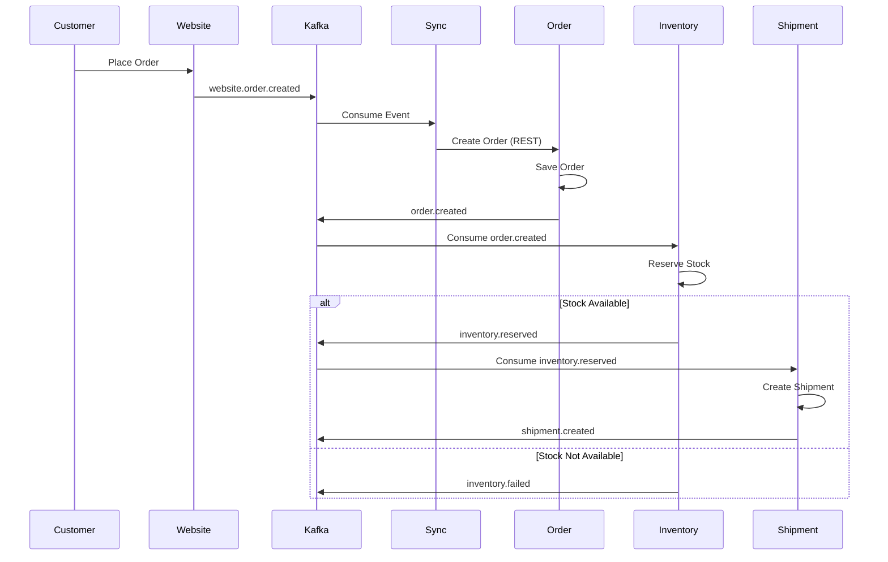
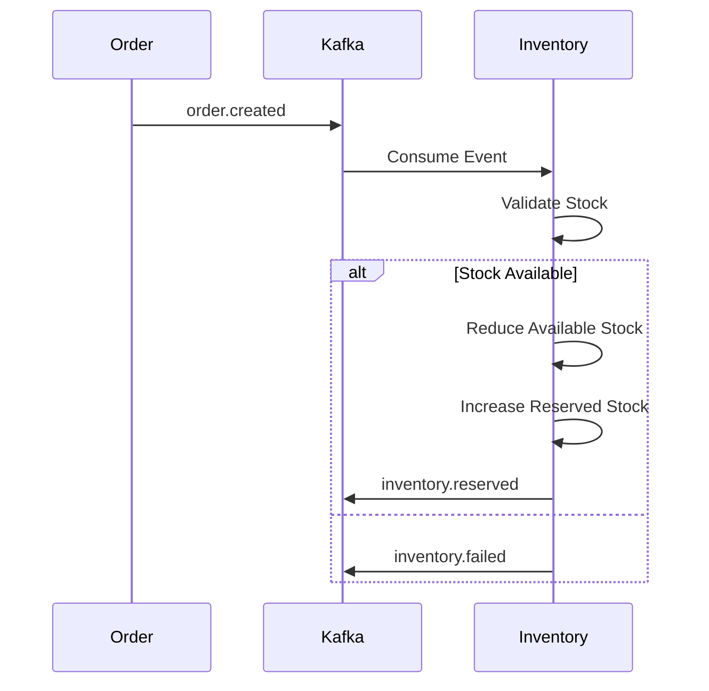
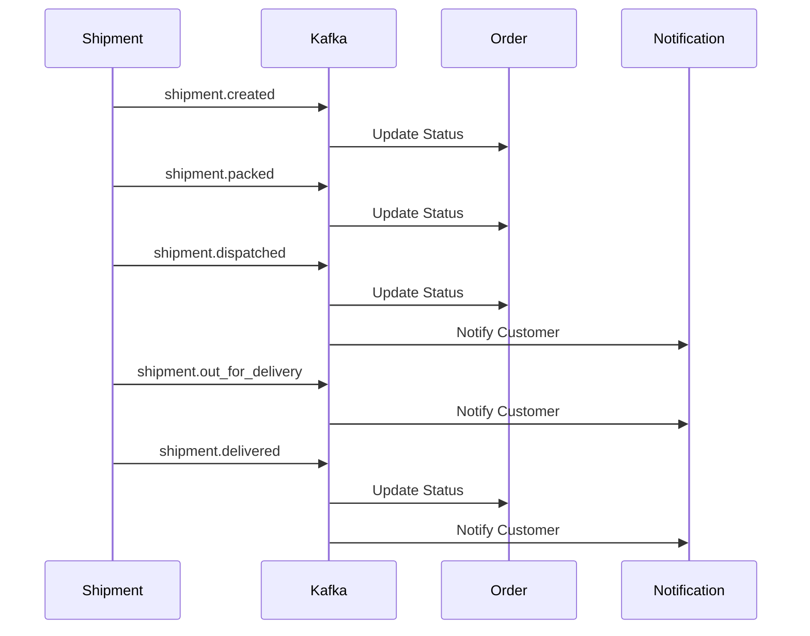
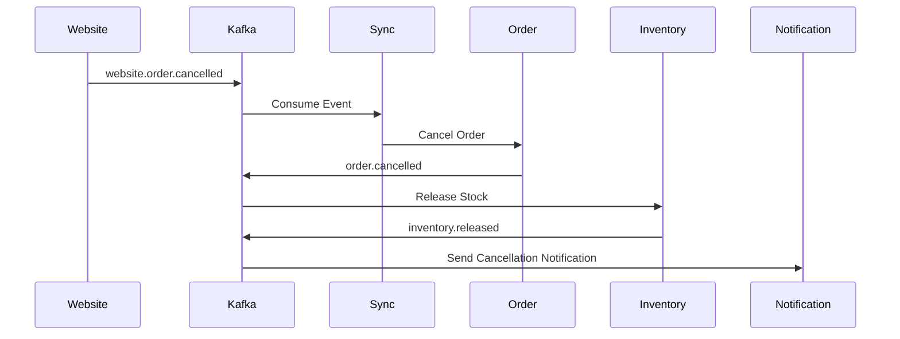
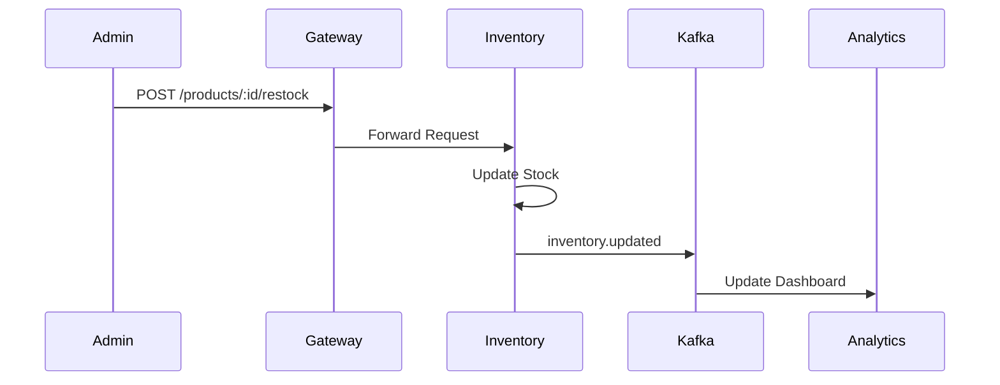
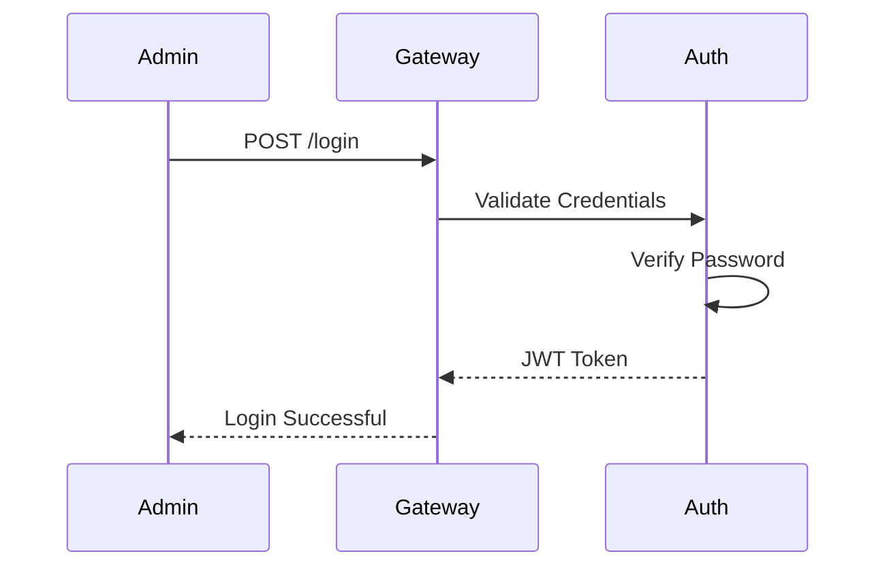
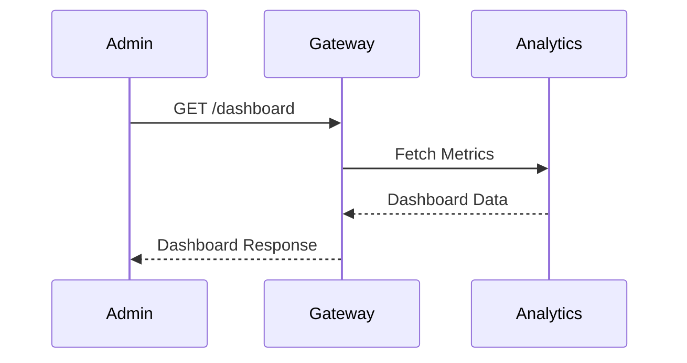
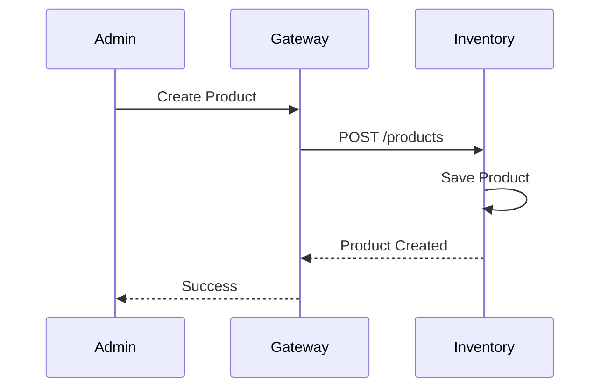
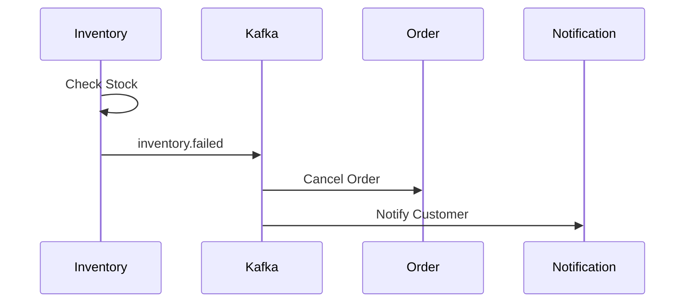
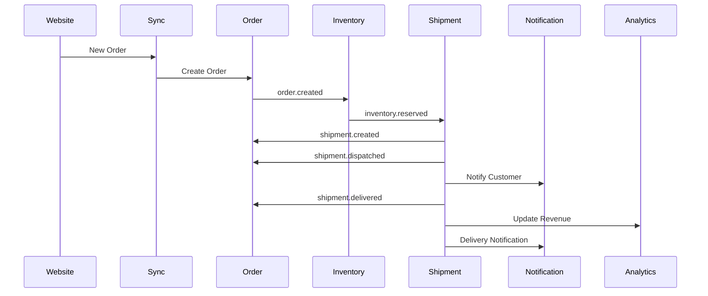

# Sequence Diagrams

## Overview

This document illustrates the interactions between services in the Order Management System (OMS).

The diagrams use **Mermaid Sequence Diagrams**, which GitHub renders automatically.

---

# 1. Order Creation

---

# 2. Inventory Reservation

---

# 3. Shipment Lifecycle

---

# 4. Order Cancellation

---

# 5. Product Restock

---

# 6. Authentication

---

# 7. Dashboard Request

---

# 8. Product Management

---

# 9. Inventory Failure

---

# 10. Complete Order Lifecycle

---

# Notes

- Frontend communicates only with the API Gateway.
- Services communicate using REST only when synchronous processing is required.
- Business events are exchanged through Apache Kafka.
- Every service owns its own database.
- No service directly accesses another service's database.

---

# Summary

These sequence diagrams describe the major workflows of the Order Management System:

- Authentication
- Order Creation
- Inventory Reservation
- Shipment Lifecycle
- Order Cancellation
- Product Management
- Dashboard Retrieval

Together, they illustrate the complete interaction between services and demonstrate the event-driven architecture used throughout the system.